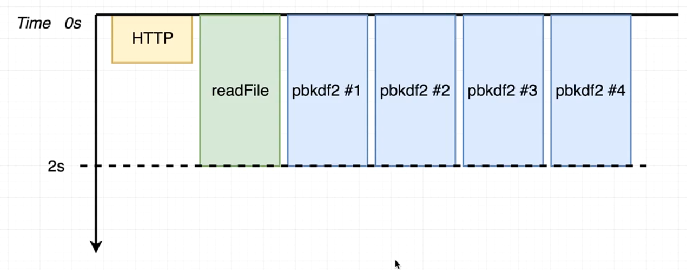

# NodeJS Advanced Concepts

Practice on advanced node topics

---

## 1 - Node internal

- NodeJS and C++
- Process and threads
- V8 & libuv
- NodeJS singlethreading
- libuv multithreading
  - threadpool (4 threads by default)

### loop.js

_Pseudocode to represent Node Event Loop._

### threads.js

_Benchmark changing the number of threads in pbdkf2 function_

### async.js

_Behavior in async methods (http request)_

### multitask.js

_Benchmark with different methods:_

All Three methods (FS read, Http request, Multiple Hashes (pbkdf2)):

- Request: 338ms
- 1º Hash: 649ms
- FS: 650ms
- 2º Hash: 758ms
- 3º Hash: 816ms

> Http requests is not handled by threadpool but by the OS. Because it runs independently, not depending on other threads, it ends up being processed faster (in this case).

Two methods (FS read, Http request):

- FS: 27ms
- Request: 310ms

---

> Summary about node internal

